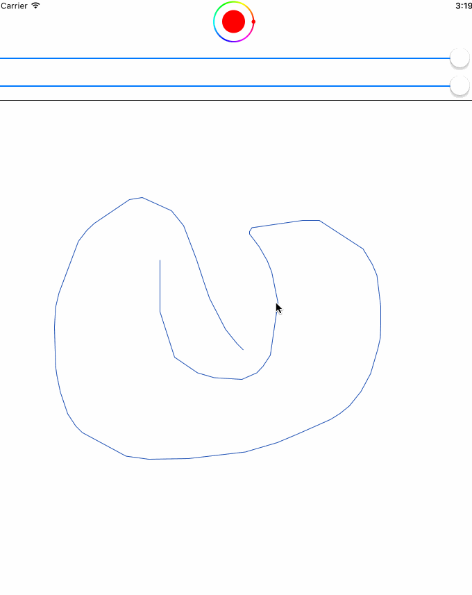

## React Native Canvas View

An [iOS-only*](#note) React Native component implementing a drawable canvas. Allows for
explicit [`controlled`](https://facebook.github.io/react/docs/forms.html#controlled-components)
behavior (using `paths` and `active={false}`) or allow the view to take care of
user input itself.

### Props
- `active:boolean` - Enable/disable the view's drawing capabilities (disable for `controlled` use)
- `strokeColor:number` - Sets the canvas stroke to the given react-native compatible color
- `strokeWidth:number` - Sets the width
- `paths:[Path]` - Explicitly set the paths drawn on the canvas (allows for a `controlled` canvas)

### ViewSnapshot Module
The actual react component (see the [components](components) directory) takes
care of any extra effort in taking a photo of the canvas.

#### `ViewSnapshot.getSnapshot(:reactNativeViewId) => Promise.resolve(dataURL)`
Given the React Native view ID, this method returns a promise which resolves
with the view's snapshot (as a data URL).

### Path
Paths can be used if you'd like to manage the user input yourself

```
{
  color: strokeColor:number,
  width: strokeWidth:number,
  points:[{ x:number, y:number }]
}
```



###### note
I made this for a personal unpublished application, but figured someone else may
find it useful, as the React Native module AND component process is a pain (and
slightly moreso if Swift is involved).
